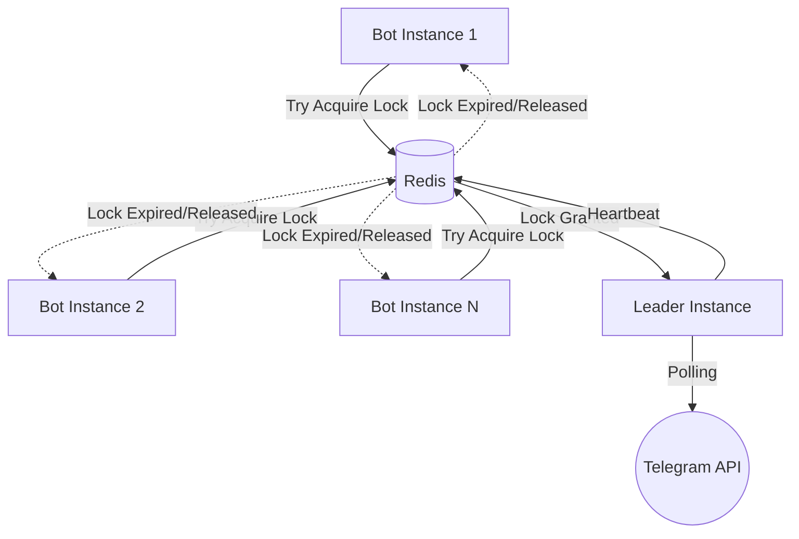

# Chain No Kizuna
> This project is a specialized branch of **[on9wordchainbot](https://github.com/jonowo/on9wordchainbot)** officially created by **[jonowo](https://github.com/jonowo)**.

**Chain No Kizuna** is a high-performance, industry-ready Telegram Word Chain game bot.

[](https://www.python.org/downloads/release/python-3130/)
[](https://github.com/aiogram/aiogram)
[](https://heroku.com/deploy?template=https://github.com/bisug/Chain-No-Kizuna)
[](https://opensource.org/licenses/MIT)

[](https://github.com/bisug/Chain-No-Kizuna/stargazers)
[](https://github.com/bisug/Chain-No-Kizuna/network/members)
[](https://github.com/bisug/Chain-No-Kizuna/issues)
[](https://github.com/bisug/Chain-No-Kizuna/graphs/contributors)
[](https://github.com/bisug/Chain-No-Kizuna)

---

## | Repository Analytics

<p align="center">
  
</p>

---

## | Acknowledgments

This software is built upon the excellent foundation laid by the original creator:

◈ **Original Author and Game Logic**: [jonowo](https://github.com/jonowo)

◈ **Fork Maintainer**: [BisuG](https://github.com/bisug)

All core game mechanics and the initial architecture are credited to the original repository. This fork focuses on modernizing the tech stack (Python 3.13), enhancing cloud deployment (Heroku), and optimizing word engine performance.

---

## | Major Improvements

Compared to the original repository, this fork introduces significant architectural and functional enhancements:

◈ **Modern Tech Stack**: Fully updated to **Python 3.13-slim** and **aiogram 3.26.0** for peak performance and long-term support.

◈ **Database & Cache Migration**: 
  - Integrated **MongoDB** for robust global statistics and game archives.
  - Added **Redis** for high-speed session management and High Availability (HA) locking.

◈ **Performance Optimization**: 
  - Implementation of **orjson** for ultra-fast JSON serialization.
  - Full codebase cleanup, removing legacy files and redundant dependencies.

◈ **Cloud & Heroku Ready**: 
  - Native compatibility with **Heroku Workers**.
  - Optimized for 24/7 reliability with built-in leader election.

◈ **Extended Gameplay**: Added multiple **new game modes** (Elimination, Banned Letters, Required Letters, etc.) and enhanced logic.

---

## | Table of Contents

◈ [Acknowledgments](#acknowledgments)
◈ [Major Improvements](#major-improvements)
◈ [Features](#features)
◈ [Tech Stack](#tech-stack)
◈ [Architecture](#architecture)
◈ [Project Structure](#project-structure)
◈ [Installation](#installation)
◈ [Usage](#usage)
◈ [Configuration](#configuration)
◈ [Customization](#customization)
◈ [Deployment Guide](#deployment-guide)
◈ [License](#license)

---

## | Features

### Diverse Game Modes

◈ **Classic**: The standard turn-based experience with strict word validation.

◈ **Chaos**: High-speed play with randomized turn intervals.

◈ **Elimination**: Survival mode where players are dropped based on performance.

◈ **Banned/Required Letters**: Specialized character constraints for advanced difficulty.

◈ **Hard Mode**: Reduced timers and stricter length requirements.

### Performance & Intelligence

◈ **DAWG Engine**: Uses a *Directed Acyclic Word Graph* for $O(1)$ prefix searching and existence checks.

◈ **Leader Election**: Integrated support for multiple bot instances; a Redis-based lock ensures only one "Leader" handles Telegram polling at a time.

◈ **State Restoration**: Automatically resumes active games after a restart or crash using persistent Redis session data.

◈ **HTML Native**: Premium UI rendering across all Telegram clients.

---

## | Tech Stack

◈ **Runtime**: Python 3.13 (Slim)

◈ **Framework**: [aiogram 3.x](https://github.com/aiogram/aiogram) (Asynchronous Telegram API)

◈ **Database**: [MongoDB](https://www.mongodb.com/) (Stats & Archives)

◈ **Cache**: [Redis](https://redis.io/) (Session Management & HA Locks)

◈ **Optimization**: `orjson` for ultra-fast serialization.

---

## | Architecture

The bot is designed for **High Availability (HA)**. It uses a Redis-based leader election mechanism to ensure that even if multiple bot instances are running (e.g., in a scaled Heroku cluster), only one "Leader" processes Telegram updates.



◈ **Leader Election**: Controlled by `chainnokizuna/services/leader.py`.
◈ **Persistence**: Game states are synced to Redis/MongoDB, allowing a new leader to resume active matches instantly.

---

## | Project Structure

```text
c:\Users\HP\Downloads\WORD\on9wordchainbot
├── chainnokizuna/
│   ├── handlers/            # Telegram command & message handlers
│   │   ├── gameplay.py      # Core mechanics (start, join, flee, end)
│   │   ├── info.py          # Help, ping, and diagnostic tools
│   │   ├── misc.py          # Maintenance mode & feedback utilities
│   │   ├── stats.py         # Player, group, and global statistics
│   │   └── wordlist.py      # Dictionary & DAWG word management
│   ├── models/              # Game logic & player data structures
│   │   ├── game/            # Specific game variants
│   │   │   ├── banned_letters.py
│   │   │   ├── chaos.py
│   │   │   ├── classic.py
│   │   │   ├── elimination.py
│   │   │   ├── guess_the_word.py
│   │   │   ├── hard_mode.py
│   │   │   └── required_letter.py
│   │   └── player.py        # Player state & session management
│   ├── services/            # Infrastructure services
│   │   ├── leader.py        # Redis-based High Availability lock
│   │   └── words.py         # DAWG Engine & word validation
│   ├── utils/               # Shared helper functions
│   │   ├── keyboards.py     # Keyboard & UI builders
│   │   └── timer.py         # Asynchronous game timers
│   └── __main__.py          # Application entry point
├── config.py                # Global settings & game balance
├── LICENSE                  # MIT License file
├── Dockerfile               # Containerization manifest
├── .dockerignore            # Files excluded from Docker builds
├── .gitignore               # Files excluded from Git versioning
├── app.json                 # Heroku deployment manifest
├── Procfile                 # Heroku process configuration
├── runtime.txt              # Python runtime version for Heroku
├── .env.template            # Environment variable template
└── requirements.txt         # Project dependencies
```

## | Frameworks & Tools

<p align="left">
  
  
  
  
  
  
</p>

---

## | Contributors

This project exists thanks to all the people who contribute.

<a href="https://github.com/bisug/Chain-No-Kizuna/graphs/contributors">
  
</a>

◈ **Maintainer**: [BisuG](https://github.com/bisug)

◈ **Original Author**: [jonowo](https://github.com/jonowo)

---

## | Installation

### Local Setup

1. **Clone the Repository**:
   ```bash
   git clone https://github.com/bisug/Chain-No-Kizuna.git
   cd Chain-No-Kizuna
   ```

2. **Initialize Environment**:
   ```bash
   python -m venv venv
   source venv/bin/activate  # Windows: venv\Scripts\activate
   pip install -r requirements.txt
   ```

3. **Configure Settings**:
   ```bash
   cp .env.template .env
   # Edit .env and fill in the variables obtained from the Configuration section.
   ```

4. **Run the Bot**:
   ```bash
   python -m chainnokizuna
   ```

---

## | Usage

Once the bot is running, add it to a Telegram group and use the following commands:

### ◈ 1. Game Initiation
Use these commands to start a specific game variant.

| Command | Variant | Description |
| :--- | :--- | :--- |
| `/startclassic` | Classic | Standard word chain game. |
| `/starthard` | Hard Mode | Reduced timers and stricter limits. |
| `/startchaos` | Chaos | Randomized intervals and high-speed play. |
| `/startelim` | Elimination | Players with lowest scores are removed. |
| `/startmelim` | Mixed Elim | A challenging combination of elimination logic. |
| `/startbl` | Banned Letters | Prevents using specific characters. |
| `/startrl` | Required Letter | Forces the use of a specific character. |
| `/startcfl` | Chosen First | Pick the starting letter of the match. |
| `/startrfl` | Random First | Bot picks a random starting letter. |
| `/startguess` | Guess Word | Solve the hidden word puzzle. |
| `/new` | (Alias) | Shortcut for Guess the Word mode. |

### ◈ 2. Gameplay Actions
Active controls for players currently in a match.

| Command | Description |
| :--- | :--- |
| `/join` | Join the entry phase of a match. |
| `/flee` | Voluntarily leave an active match. |
| `/extend` | Add 30 seconds to the joining phase. |
| `/stats` | View your detailed stats (Aliases: `/stat`, `/stalk`). |
| `/top` | View global leaderboard (Aliases: `/leaderboard`, `/topseekers`). |

### ◈ 3. Information & Support
General utility commands for users.

| Command | Description |
| :--- | :--- |
| `/help` | Display the main help menu. |
| `/gameinfo` | Detailed documentation on every game mode. |
| `/ping` | Check bot latency and cluster health. |
| `/runinfo` | View current bot instance and leadership status. |
| `/groupstats` | Show metrics for the current group only. |
| `/globalstats` | Show aggregate lifetime bot metrics. |
| `/feedback` | Send a report or message to the developer. |
| `/troubleshoot` | Common fixes for bot issues. |
| `/chatid` | Get the numeric ID of the current chat. |

### ◈ 4. Word Dictionary
Commands for interacting with the DAWG engine.

| Command | Description |
| :--- | :--- |
| `/exists <word>` | Query if a word is in the dictionary (Alias: `/exist`). |
| `/reqaddword` | Request a new word addition (Alias: `/reqaddwords`). |

### ◈ 5. Administrative Control
Restricted to Group Admins or the Bot Owner.

| Command | Access | Description |
| :--- | :--- | :--- |
| `/end` | Admin | Terminate the current local game. |
| `/forcestart` | Admin | Start the game immediately. |
| `/addvp` | Admin | Add a Virtual Player (Bot) to the game. |
| `/remvp` | Admin | Remove the Virtual Player. |
| `/forceskip` | Owner | Force-skip the current player's turn. |
| `/forcejoin` | Owner | Force-add a user to the match. |
| `/forceflee` | Owner | Force-remove a user from the match. |
| `/killgame` | Owner | Global emergency stop for all games. |
| `/maintmode` | Owner | Toggle global maintenance/update mode. |
| `/addword` | Owner | Instantly add a word to the DAWG. |
| `/rejword` | Owner | Reject a pending word addition. |
| `/leave` | Owner | Force the bot to leave the group. |
| `/db` | Owner | Inspect MongoDB/Redis status (Alias: `/mongo`). |
| `/playinggroups` | Owner | List all currently active matches globally. |

---

## | Configuration

The bot is configured entirely via environment variables. Create a `.env` file in the root directory or set these in your hosting provider's dashboard (e.g., Heroku Config Vars).

### ◈ Environment Variables Summary

| Variable | Description | Required | Default |
| :--- | :--- | :---: | :--- |
| `TOKEN` | Main Telegram Bot Token from [@BotFather](https://t.me/BotFather) | Yes | - |
| `MONGO_URI` | MongoDB Connection URI (Atlas or Local) | Yes | - |
| `REDIS_URL` | Redis/Valkey Connection URL (Upstash/Cloud) | Yes | - |
| `OWNER_ID` | Your numeric Telegram User ID | Yes | - |
| `VP_TOKEN` | Virtual Player (AI) Bot Token | No | - |
| `DB_NAME` | Name of the MongoDB database | No | `WordChainDB` |
| `ADMIN_GROUP_ID` | Group ID for administrative reports/logs | No | `0` (Disabled) |
| `OFFICIAL_GROUP_ID` | ID of your community's official game group | No | `0` |
| `SUPPORT_GROUP` | Username of your Support Group (no @) | No | `SuMelodyVibes` |
| `UPDATE_CHANNEL` | Username of your Update Channel (no @) | No | `SuMelodyVibes` |
| `VIP` | List of VIP player user IDs (Comma-separated) | No | `[]` |
| `VIP_GROUP` | List of VIP group chat IDs (Comma-separated) | No | `[]` |

---

### ◈ Detailed Setup Guides

#### 1. Obtaining a Telegram Bot Token
1. Start a chat with **[@BotFather](https://t.me/BotFather)** on Telegram.
2. Send `/newbot` and follow the naming instructions.
3. Copy the **HTTP API Token** provided. This is your `TOKEN`.

#### 2. Setting up MongoDB Atlas
1. **Register**: Sign up at [MongoDB Atlas](https://www.mongodb.com/cloud/atlas).
2. **Cluster**: Create a free **M0 Shared Cluster**.
3. **Database User**: Create a user with **Password Authentication** and **Read/Write** access.
4. **Network Access**: Add IP `0.0.0.0/0` (Allow Access from Anywhere) for cloud hosting compatibility.
5. **Connect**: Select **Connect** ➜ **Drivers** ➜ **Python** and copy the URI. 
   ◈ *Replace `<password>` with your created user's password.*

#### 3. Setting up Redis (Upstash)
1. Visit [Upstash](https://upstash.com/) and create a free Redis database.
2. Under the **Details** tab, find the **REST API** or **Redis Connect** section.
3. Copy the `redis://...` URL. This is your `REDIS_URL`.

#### 4. Finding Your Telegram ID
1. Message **[@userinfobot](https://t.me/userinfobot)** and send any text.
2. It will reply with your numeric **Id**. This is your `OWNER_ID`.

---

## | Customization

You can fine-tune the bot's behavior by modifying the `GameSettings` class in `config.py`. This is ideal for balancing the game's difficulty and pacing.

| Setting | Description | Default |
| :--- | :--- | :--- |
| `MIN_PLAYERS` | Minimum players needed to start a game. | `2` |
| `MAX_PLAYERS` | Maximum players allowed in a standard room. | `50` |
| `MIN_TURN_SECONDS` | Fastest possible turn timer (Hard Mode). | `20s` |
| `MAX_TURN_SECONDS` | Slowest possible turn timer (Classic). | `40s` |
| `MIN_WORD_LENGTH` | Global minimum length for any word. | `3` |
| `JOINING_PHASE` | Time (seconds) players have to `/join`. | `60s` |

◈ **Note**: After changing these values, a restart of the bot instance is required to apply the new settings.

---

## | Deployment Guide

### Option 1: Heroku (Recommended)

#### ◈ Mode A: One-Click (Easiest)
Simply click the button below and fill in the environment variables:

[](https://heroku.com/deploy?template=https://github.com/bisug/Chain-No-Kizuna)

#### ◈ Mode B: Manual GitHub Connection
1. **Fork** this repository to your own GitHub account.
2. Go to your [Heroku Dashboard](https://dashboard.heroku.com/apps) and create a new App.
3. In the **Deploy** tab, select **GitHub** as the deployment method.
4. Search for your forked `Chain-No-Kizuna` repo and click **Connect**.
5. Enable **Automatic Deploys** if desired.
6. Go to **Settings** ➜ **Reveal Config Vars** and add all variables obtained above.
7. Manual Deploy the `main` branch once to trigger the initial build.

---

### Option 2: Virtual Private Server (VPS)

For 24/7 reliability on Ubuntu/Debian, use `systemd`:

1. **Install Dependencies**:
   ```bash
   sudo apt update && sudo apt install python3-pip python3-venv redis-server -y
   ```

2. **Setup Project**:
   ```bash
   git clone https://github.com/bisug/Chain-No-Kizuna.git && cd Chain-No-Kizuna
   python3 -m venv venv
   ./venv/bin/pip install -r requirements.txt
   cp .env.template .env # Fill with variables from the Configuration section
   ```

3. **Create Service File**:
   `sudo nano /etc/systemd/system/chainbot.service`
   ```ini
   [Unit]
   Description=Chain No Kizuna Bot
   After=network.target

   [Service]
   WorkingDirectory=/home/youruser/Chain-No-Kizuna
   ExecStart=/home/youruser/Chain-No-Kizuna/venv/bin/python3 -m chainnokizuna
   EnvironmentFile=/home/youruser/Chain-No-Kizuna/.env
   Restart=always

   [Install]
   WantedBy=multi-user.target
   ```

4. **Start Service**:
   ```bash
   sudo systemctl enable chainbot
   sudo systemctl start chainbot
   ```

---

### Option 3: Docker (Orchestrated)

1. **Build Image**:
   ```bash
   docker build -t chainnokizuna .
   ```

2. **Run Container**:
   ```bash
   docker run -d \
     --name chainbot \
     --env-file .env \
     --restart unless-stopped \
     chainnokizuna
   ```

◈ **Note**: Ensure your `REDIS_URL` and `MONGO_URI` point to accessible instances (e.g., using `host.docker.internal` or external cloud URLs).

## | Platform Compatibility & Support

This repository has been definitively **tested and verified on Heroku**. While it contains configurations for VPS and Docker, it has not been extensively validated across all possible hosting environments.

◈ **Reporting Issues**: If you encounter bugs or deployment failures on other platforms, please raise a detailed issue in the [GitHub Issues](https://github.com/bisug/Chain-No-Kizuna/issues) section.

◈ **Developer Support**: For immediate assistance or community discussion, contact me via the [Support Group](https://t.me/SuMelodyVibes).

---

## | License

This project is licensed under the **MIT License**. See the `LICENSE` file for details.

---

> **Support**: Visit [@SuMelodyVibes](https://t.me/SuMelodyVibes) for official updates and developer support.